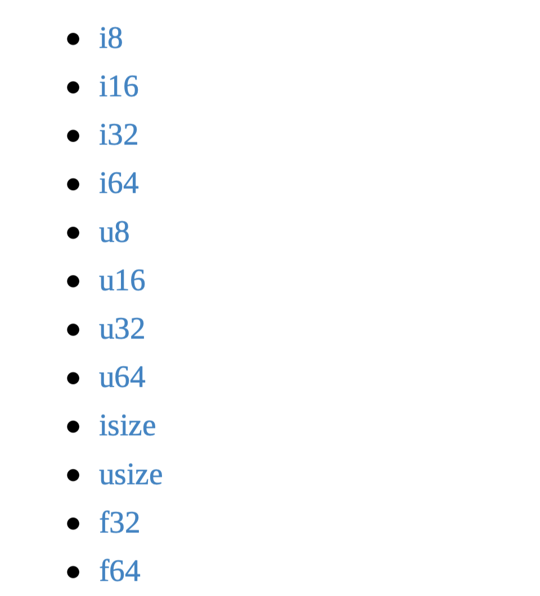

#### 1.什么是Cargo?

Rust的构建系统和包管理工具。同时我们可以用Cargo来管理Rust项目。

也即三项工作：

- 构建代码
- 下载代码依赖的库
- 编译这些库

最佳实践就是用`Cargo`来管理项目，这也是绝大部分项目的实践方式。

基础语句：

```rust
cargo build 
cargo run
```

#### 2.变量绑定 && 模式

```rust
let x = 5;
```

`let`用于声明一个绑定。

Rust语言中的变量绑定有一些不同的巧妙之处。左侧是一个**模式**，不仅仅是一个变量。

所以我们可以写出一些更有趣的绑定：

```rust
let (x, y) = (1,2);
```

这和动态语言的设定很像。

**而Rust是一个静态语言。**

#### 4.类型注解 && 类型推断

静态类型语言需要预先确定需要的类型，不过同时Rust有强大的类型推断系统，可以自动确认是什么类型。

Q: 如何加上类型？

A: 在变量后面加上冒号以及类型名称。

```rust
let x : i32 = 5;
```

`i`开头表示有符号整数，`u`开头表示无符号整数。

#### 5.可变性 vs. 不可变性

**默认绑定是不可变的。**

```rust
let x = 5;
x = 10; // wrong
```

如果是想要可变的，则可以用：

```rust
let mut x = 5; // right
x = 10;
```

默认变量是不可变的，有很多理由，主要理由是：安全性。

如果确实想要变量可变，加上`mut`关键字即可。

#### 5.绑定必须初始化

Rust不会让我们使用一个没有经过初始化的值。

#### 6.函数

函数声明非常简单：

```rust
fn main() {
}
```

有参数的函数：

```rust
fn print_number(x: i32) {
  println!("x is {}", x);
}
```

函数参数的声明与`let`声明类似。

但是值得注意的是，函数参数必须加上类型，而`let`是可以自动推断的。毕竟，Rust是一门静态语言。

**Rust的返回值：只能返回一个值，在箭头后面添加类型。**

```rust
fn add_one(x: i32) -> i32 {
  x + 1 // 无分号，有就错了
}
```

Rust是基于表达式的语言。  只有两种语句，其他都是表达式。

**表达式 vs. 语句**

表达式返回一个值，语句不是。

#### 7.函数指针

```rust
let f : fn(i32) -> i32; // 指向一个获取i32类型并返回i32的函数的变量绑定
```

```rust
fn plus_one(i : i32) -> i32 {
  i + 1 // 返回值
}
let f : fn(i32) -> i32 = plus_one;
let f = plus_one; // 自动推断
```

#### 8.数据类型 ： 原生类型

**布尔类型**

```rust
let x = truel
let y: bool  = false;
```

**char类型**

```rust
let x = 'x';
let two_hearts = '';
```



`i`开头表示有符号数，`u`开头表示无符号数。

**数组**

默认是不可变的。

```rust
let a = [1,2,3]; // 方括号初始化
let mut m = [1,2,3];
```

数组的类型是`[T; N]`其中`T`表示的是泛型，N表示数组的长度。

```rust
let a = [0; 20]; // 数组初始化为0，[i32; 20]
a.len(); // 20
```

数组访问也是从0下标开始。

**数组切片**

一个切片是一个数组的引用，或者说是视图，不会对数据进行拷贝。底层实现是一个指向数据开始的指针和长度。

**如何用切片？**

`&, []`组合。

其中`&`表示切片类似于引用，`[]`表示范围，我们可以定义切片的长度。

```rust
let a = [0,1,2,3,4];
let complete = &a[..]; // a中所有元素
let middle = &a[1..4]; // 左闭右开，1,2,3
```

**字符串**

`str`，不定长类型。

**元组**

固定大小的有序列表。

```rust
let x = (1, "hello"); // 长度为2的元组，类型不同，是允许的
let x: (i32, &str) = (1, "hello"); 

let mut x = (1, 2);
let y = (2, 3); 
x = y; // 相同的数量和类型，可以赋值

let (x, y, z) = (1,2,3); // 解构let，左边是模式
```

消除歧义：

```rust
(0, ) // 单元素tuple
(0); // 括号中的0
```

**元组索引**

```rust
let tuple = (1, 2, 3);
let x = tuple.0;
let y = tuple.1;
let z = tuple.2;
println!("x is {}", x);
```

索引也是从0开始，用的是`.`语法，不是中括号索引语法。

再看函数指针：

```rust
fn foo(x : i32) -> i32 {
  x // return x
}
let x: fn(i32) -> i32 == foo; // 函数指针
```

#### 9.注释

**单行注释：**

`//` or `//!`

书写注释的一些tip: 加上参数和返回值，并提供一些用例，是非常有帮助的。

#### 10.常用语句

`if`**条件语句**

```rust
let x = 5;
if x == 5 {
  println!("x is five!");
} else if x == 6 {
  println!("x is six!");
} else {
	println!("x is not five or six!");
}
```

这种语法形式很像是动态语言的格式。

除了这些标准写法外，还可以按照下面的方式来写：

```rust
let x = 5;
let y = if x == 5 {
  10
} else {
  15
}; // y: i32
```

或者一行写完 ：

```rust
let x = 5;
let y = if x == 5 {10} else {15}; //y: i32
```

**循环**

三种循环语句的写法：

- loop
- while
- for

`loop`是无限循环，最简单的循环。

```rust
loop {
  println!("Loop forever!");
}
```

`while `循环

```rust
let mut x = 5;
let mut done = false;
while !done {
  x += x - 3;
  println!("{}", x);
}
if x % 5 == 0 {
  done  = true;
}
```

总体看来都是动态语句的写法。

`while`很容易写出无限循环，而用`loop`来写无限循环则更直接。

`for`循环

```rust
for (x = 0; x < 10; x++) {
  println!("%d\n", x);
}

for x in 0..10 {
  println!("{}", x); // x: i32
}

for var in expression {
 code 
}
```

上面这段也可以自动推断类型。

